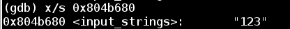
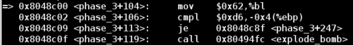
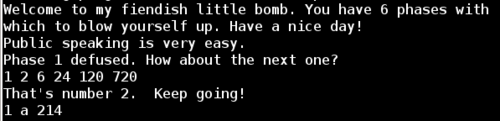
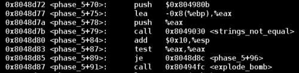
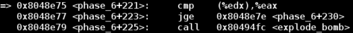
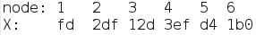
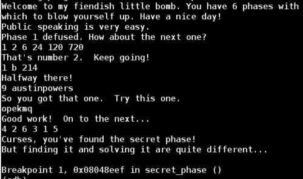

I recently discovered a popular reverse engineering assignment in many university CS programs called the <a href="http://www.cs.cmu.edu/afs/cs/academic/class/15213-s02/www/applications/labs/lab2/bomblab.html">Binary Bomb</a>. I didn't have it at my school, but it looked like a fun project so I decided to try it.

The binary bomb is a simple command line program that asks you to enter a particular secret string. If type the incorrect string, the program explodes by printing out *BOOM!!!* and terminating. If you enter the correct string, the program proceeds to the next phase, which expects another particular string. In a typical univeristy setup, each explosion will automatically notify your professor and deduct a small percentage from your final assignment grade.

The goal is to reverse engineer the executable in order to find the expected string for each phase and prevent the bomb from blowing up.

I completed the project over a few days, and have written a detailed walkthrough below.

If you'd like to play along at home, the original executable is up on the <a href="http://web.archive.org/web/20130412102116/csapp.cs.cmu.edu/public/1e/bomb.tar">Internet Archive</a>. Make sure you are running the executable on a 64-bit Linux box or VM.

## Phase 1

I fired up [gdb](https://www.gnu.org/software/gdb/), added some breakpoints before and after the first input string required for the bomb. Then I stepped through the disassembled instructions to find a function called `phase_1`.

Note that between the beginning and end of `phase_1` there is a call to the function `strings_not_equal`. 

So we have two options here to beat phase 1:

 1. Change the `je` (jump if equal instruction) to be a `jne` (jump if not equal), which will skip over `explode_bomb` to take us to the next phase. This method is easy to do, but it doesn't actually give us the pass code for the first phase. So we would have to do this jump every time.

 1. Dive into the `strings_not_equal` call and explore the code. There will likely be a string comparison in there that will reveal the string for this phase. In this way we can simply type in the string to beat phase 1 and go into phase 2 in the expected way.

Let's disassemble `strings_not_equal`:

Notice that there are two calls to a function called `string_length`, followed by a jump depending on the the result of these function calls. Furthermore, notice that the registers `esi` and `edi` are pushed onto the stack before their respective `string_length` calls. This tells us that these registers are used as function arguments.

These instructions tell us that the function first compares the length of the input string before even checking if the user's input matches the password.

Let's examine the argument passed to the first `string_length` call:

Note that we are looking for the value of the register `esi`, which is stored at `0x804b680`. Let's examine it as a string:

In this case, `esi` points to `123` which is what I typed in for my attempt for this phase.

Now let's take a look at `edi` which is the register used in the second `string_length` call, we will see what the program is comparing our input string against, which should be the password to phase 1.

Let's run the binary bomb and try it out:

Phaes 1 complete!

## Phase 2

We can start by disassembling the `phase_2` function just like we did for `phase_1`:

While the `read_six_numbers` function hints that this round will be looking for 6 numbers of input, it doesn't really tell us anything about the values of these numbers. Notice the two `explode_bomb` calls in `phase_2`. Let's add some breakpoints throughout the function and enter `012345` as our input.

The first `explode_bomb` call is after a comparison between the constant `0x1` and the value at address `(%ebp - 0x18)`. Examining the memory location reveals that the value is `0`. After some trial and error I discovered that this is the first number of my attempted password `012345`. We can prove this by examining the values in memory of offsets other than `0x18`.

Now we know `(%ebp - 0x18)` corresponds to the first element of our input. If we want to avoid the first `explode_bomb` call, then the first `cmpl` (comparison instruction) must consider the values at the two addresses to be equal. This means the first digit of this password must be `1`.

Now if we restart the bomb and use this new knowledge, we can bypass the first comparison and make it to the second one.

The second comparison is slightly more complicated and depends on the result of a (signed) multiplication. First we multiply `(%esi - 0x4 + 4*%ebx)` by `%eax`, and then store the result in `%eax`. In our case it gives us the following:

Now we meet the second comparison statement. The right hand side is simply an index to the current element of our input. This iteration it's comparing the value in `%eax` to the second input value. If this comparison is not-equal, then the bomb will explode. Since the value of `eax` is 2, this means that the second digit of our input should be `2`.

This time instead of re-running the program, we can just set the value directly in memory.

Now we reach the third round of the `phase_2` loop. Let's take a look at `%eax` again to see the expected digit. 

Doing this one more iteration reveals that the program expects the first 4 digits of the 6 digit password to have values `1 2 6 24`. These are not arbitrary numbers. The pattern looks like increasing [factorial digits](https://en.wikipedia.org/wiki/Factorial). Notice that `1 2 6 24` is `1! 2! 3! 4!`

Based on the function name, we can make the guess that the required password is just 6 numbers, and each one is the factorial of its 1-based index. This would be `1! 2! 3! 4! 5! 6!` or `1 2 6 24 120 720`

Success! 

## Phase 3

I restarted the program in gdb, set a breakpoint at the `phase_3` function, and entered the passwords we've found so far for phase 1 and 2. Then I entered an initial guess for phase 3 of `try one try`.

Looking at the first dozen lines of the disassembled `phase_3` function, note the call to [sscanf](https://www.tutorialspoint.com/c_standard_library/c_function_sscanf.htm). If we examine the arguments passed to this function, then we can figure out the input format of the password.

Notice that our input string and a format string was passed into `sscanf`. The format string is in the format `%d %c %d`, so it expects an integer, a character, and another integer.

Since I entered ``ry one try` as my initial guess, this does not fit the format that this call to `sscanf` expects. This will cause `sscanf` to return and set `%eax` to 0

This would result in the comparison of `%eax` and `0x2` NOT taking the corresponding jump, and cause the bomb to explode. 

So now I restarted the application with a better guess. Now that jump after the `%eax` comparison will succeed, we run into another conditional check. Examining the value in memory at `(%ebp - 0xc)` shows that the program is comparing the first number of our input to the value 7, and jumping (to avoid an explosion) if the number is less than or equal to 7. Since our input number was 1, this condition is true and we skip this call to `explode_bomb`. So far so good.

The next line of interest is a `jmp` statement which will jump to the offset of the value stored at `(0x80497e8 + %eax*4)`.

At this point `%eax` is set to the first number in our input string, so our jump takes us to the following position:

The next comparison examines our third input value (an integer) stored at `(%ebp - 0x4)` and checks it against the value `0xd6`, or `214` in decimal.

In order to beat this comparison, we can restart the app again with the following input:

Then, the final comparison checks our second input value (of type char) against `%bl`. Examining the value of `%bl` reveals that the application is expecting a `b` character for this situation

So we run the application one final time including everything we've learned about the `phase_3` function, and we have now successfully completed phase 3!

## Phase 4

Lets disassemble the `phase_4` function next. Once again there is a call to sscanf, so let's peek at the format string to see what kind of input this phase expects.

Notice that in the second highlighted segment our input value is passed into the function `func4`, and the result of this function is compared against `0x37` (`55` in decimal).

Now let's look at func4 in chunks in order to simplify it. First looking at **section A**, if the input value (located at `[%ebp + 0x8]` and then copied into `%ebx`) is less than or equal to `1`, then the function jumps down to **section B** and sets `%eax` to `1`, which will become the return value.

Otherwise, the function steps into **section C** which will call `func4` recursively, passing in the original input decremented by **one**. This is followed by another call to `func4`, passing in the original input decremented by **two**. Then the result of these two function calls is summed and copied into `%eax` to become the return value of the function.

After stepping through a few iterations, I realized that the function was defined as `func4(x) = func4(x-1) + func4(x-2)`, which looks like the [Fibonnaci sequence](https://en.wikipedia.org/wiki/Fibonacci_number) of the input number. 

However, notice that `func4` will return `1` if the input is `0`, whereas `Fib(0)` = `0`. Therefore if we have an input of `x = 2`, `func4` would return `1` for both the `x - 1 = 1` and `x - 2 = 0` calls.

Remember that the `phase_4` function succeeds if the output of `func4` was `0x37` (`55` in decimal). Since the `Fib(10) = 55` and we know that `func4(0) = func(1) = 1`, `func4(2) = 2`, then we just need to find an input x such that `Fib(x + 1) = 55`. Since `Fib(10) = Fib(9 + 1) = 55`, we know that the solution for this phase is 9.

## Phase 5

Let's look at the first chunk of the disassembled `phase_5` function:

Notice the call to the `string_length` function, and the resulting jump away from `explode_bomb` if the return value is `6`. Now we know that our input string must contain exactly 6 characters.

Looking down to the location of the jump, we have the following block of code that forms a loop. In this test run I've entered `123456` as my input. 

Notice that my input string is stored at `%ebx`.

In the loop above, the code takes our input value `%ebx` plus some offset `%edx` and copies it into `%al`. Then it performs a binary `AND` operation between `0xf` and `%al`, and stores the result in `%al` and subsequently into `%eax`. Finally, it copies the character at `[%esi + %eax]` into `%al`, and into an initially empty string stored at `[%ecx + %edx]`.

To start, let's look at what is being stored at `%esi`:

So there seems to be an array of characters stored at `%esi`. Each character from our input string is binary `AND`ed with `0xf`. Then this resulting value is used as a lookup index in `%esi` to find the final character mapping. 

Now that we understand how the function works, we can examine the jump that avoids the final `explode_bomb` call. This code checks to see if the result of the logic above is equal to the string stored at `0x804980b`

Now we know that the transformed version of our input string must equal `giants`. All we need to do is reverse engineer an input string that ends up as `giants` in the algorithm. 

Taking another look at the substitution array stored at `%esi`:

Notice that 'g' has an index of 15. Therefore we must find a character that when `AND`ed with `0xf` will result in `15` decimal which is also `0xf` hex. This type of operation is called a [bitwise mask](https://stackoverflow.com/a/10493604/12353703). To succeed here, we need to find a character that has `1111` as the least significant 4 bits. The 4 most significant bits don't matter here. For example, the hex ASCII value for the letter `o` is `6F`, which has a binary value of `0110 1111`, so it fits our requirement.

We can continue in a similar fashion and find characters which match for remaining "iants". My solution was the string `opekmq`, but there are many solutions for this phase.

## Phase 6

Notice the function call on the last line of the excerpt above reads six numbers from standard input, so now we know the first requirement of the password for this phase. I'll enter the input `1 2 3 4 5 6` to satisfy the 6 digit requirement.

Next let's look a little further down the function:

And after the jump:

Notice that in the above block of code we have a loop. The counter for the loop is `%edi`, which is initially set to `0` using the `XOR` trick above, and the loop continues until `%edi` has reached a value of 6. Since `%ebp - 0x18` is the location of the first input, this block of code is just iterating through all of the input values. 

While iterating through all numbers, the function ensures that each number is less than `5`. Notice that this comparison uses the `jbe` command, which does not test for the sign of the number. Keeping this in mind, this process can be summarized as the second requirement: Each of the six numbers must be between 1 and 6 inclusive.

Next, let's examine the nested loop below:

The loop has iterators `%ebx` and `%edi`. We're comparing each number against every other number, and only jumping over the `explode_bomb` call if the numbers are not equal. Essentially this code is ensuring that the password consists of unique numbers 1-6.

The next restriction is the most complicated. Let's go down near the final explode_bomb call:

This part seems complicated initially. Ignore the early `lea` instruction since it's a [`NOP` to ensure code alignment](https://stackoverflow.com/questions/2553517/what-is-register-eiz). Skipping over that, I've highlighted the relevant loop above in red. After an initial `%esi` is set, the code is comparing the value at `%esi`, with the value at `%esi + 0x8`, and the bomb explodes if the value at `%esi + 0x8` is less than the value at %esi.

But what are `%esi` and `%esi + 0x8`?

%esi points to a node data structure. Now since debugging information is not available for this application, we can't find the definition of a node, but looking at what is given above, we can gain some intuition about it. Let's start by looking at what %esi + 0x8 leads to:

Notice that each of these nodes contain at least three things. Firstly some numerical value, then the input value corresponding to the node number (from the original "1 2 3 4 5 6" input), and finally a pointer to the next node. This phase uses the common linked list data structure.
Some trial and error of input reveals two things. The first and second values in the above screenshot are identical for any order of input. Node1 will always have a first value of 0xfd and a second value of 0x1, node2 of 0x2d5 and 0x2, and so on. The only thing that changes is the pointer to the next node, which depends on the order of input values. For example, an input of "6 5 4 3 2 1" will result in node6 -&gt; node5 -&gt; node4 -&gt; node3, etc. 
So now to beat this phase let's take a closer look at conditions surrounding the explode_bomb call.

At this point %edx contains the pointer to the next node, and %eax contains the value of the current node's first column number. Let's call this first column number X. So this code compares if the current node's X value is greater than the next node's X value, and skips the explode_bomb call if this is the case.
So we have the following nodes and associated X values:

Since we are iterating over all nodes, and a node's next pointer is related to the order of input, we just need to find the correct arrangement of numbers such that the current node's X is always greater than its next node's X value. More generally, we need to sort the numbers in decreasing order with respect to their X value.

Now the nodes are sorted in order of decreasing X value. At this point we have satisfied all requirements of the password for this phase!

So now we've solved the bomb! Congratulations!
Except there's a rumor that there is a secret phase in the bomb, and next step will be to find and solve that one.
<a href="http://www.vedranb.com/post/20455275313/secret-phase">Secret phase here!</a>

## Secret Phase

Begin from <a href="http://www.vedranb.com/post/19285223085/no-disassemble">here</a>. 
So here we are, the final phase. But first we have to figure out the way to the entrance of this secret phase.
If we poke around main, we'll notice that each time the correct password for a phase has been entered, the bomb calls a "phase_defused" method.
Taking a look at the disassembled phase_defused, we note something interesting:

 There's our entrance to the secret phase! Now as usual there are two ways to get in. Either we alter the jump instructions and force the execution of the function call, or we take the time to figure out the true nature of the phase_defused function in order to enter the secret phase legitimately. This is analogous to deciding whether to bash down a door, or pick the lock.
Since we're not strapped for time, and we don't know the complexity of the secret_phase function (aka what we may screw up by skipping important jumps), we'd better go with approach 2, and determine the path of entrance analytically.
To do this we'll begin by looking at the sscanf call at the top of the code shown above. Let's examine the format string and input:

So the input to this sscanf call is the string "9 ", which happens to be the correct password for phase 4. However this sscanf call is looking for 2 inputs in order to avoid the jump which skips the call to secret_phase. So we need to add a string of characters after our password for phase 4. But what should this string be?
Well let's take a look at the inputs to the strings_not_equal call a little further down to get an idea of the string we need.

So here we have the key to get into the secret phase, the string "austinpowers". Now we restart the app with a break point on the secret_phase function call, and the following input:

Originally I thought that the secret phase was ridiculously easy, but this turned out to be a lucky choice of initial input.
The secret phase works by taking in a string input, converting it to an integer, and then comparing it to some hardcoded value. If these values match the it proceeds to run the  function fun7. If fun7 returns a value of 7, then the bomb is defused.

The inputted value is moved from %eax to %ebx, then subtracted by one, and placed back into %eax. Finally we have the comparison against 0x3e8, which is 1000 in decimal. So to pass this comparison we must enter a number that is less than or equal to 1001. Fun7 is relatively complicated, and bounces around a few data structures, so I won't cover its functionality at this time. 
Before even diving into fun7, I simply entered 1001 as my first input guess, which turned out to be the correct answer! Provided I have some free time I'll examine fun7 in detail to determine why 1001 is the correct input.
Be that as it may, this bomb has now been defused, and the world is safe once more.

