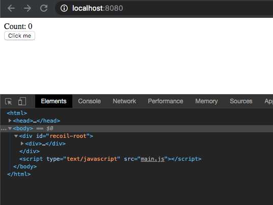

This is my third post in a series where I document my development of [recoil](https://github.com/vedran/recoil), a React clone built from scratch for learning purposes.

My [last post](/blog/recoil-custom-components/) added support for creating stock HTML elements (divs) as well as custom components.

We did this with a simple `createElement` method that would call a provided render function. The render function returned either a string directly or it called other `createElement` functions which ultimately returned a string themselves. Then we created a function component called `DivComponent` to handle `<div>` creation, and one called `GreetingComponent` to test custom component creation.

The code looked like:

```javascript
function createElement(component, props = {}) {
  // String "component", so just return the string. Like a text node in HTML
  if (typeof component === "string") {
    return component
  }

  // 'render' the component
  return component(props)
}

function DivComponent({ children, ...otherProps }) {
  // Turn each child into a string of HTML
  let processedChildren = (children || []).map(child =>
    createElement(child, otherProps)
  )

  // Wrap the html string of the children in the div tags
  return `<div>${processedChildren.join("\n")}</div>`
}

function GreetingComponent({ name }) {
  return createElement(DivComponent, {
    children: [createElement(`Hello ${name}`)],
  })
}
```

Recoil only supports functional components, so the next step is to give the functional components the ability actually do something by implementing [React Hooks](https://reactjs.org/docs/hooks-intro.html). The biggest change here is that somehow state must persist across renders.

## Data structure for persisting state

My method for persisting state is to build a Wrapper class around the functional component. This class will store the state as an instance variable, so that subsequent calls to `render()` can access it.

Then we can build a a tree structure of these Wrapper classes that represent the app and its components. This way we can re-trigger the `render()` call on the component whenever our hooks are called.

```javascript
class Wrapper {
  constructor(renderFunc, props) {
    this.renderFunc = renderFunc
    this.props = props
  }

  render() {
    // TODO: Figure out how to create and manage state
    return this.renderFunc(this.props)
  }
}
```

At this point, we should also split the HTML string generation from the component rendering to keep things simple. We can update `createElement` to only return `Wrappers` rather than strings or functions.

```javascript
function createElement(renderFuncOrString, props) {
  // Only return Wrappers now

  if (typeof renderFuncOrString === "string") {
    return new Wrapper(() => renderFuncOrString, props)
  }

  return new Wrapper(renderFuncOrString, props)
}
```

Now that we know everything is a `Wrapper`, we can create another function that converts the `Wrapper` to HTML. We'll call this function `buildDOM`.

Let's also use the proper browser API to generate HTML elements rather than manually building the opening and closing tags as strings. Eventually we will want to add HTML attribute props like `style` and `onClick`, it's going to be really messy to do the string manipulation ourselves. So we'll use `document.createElement` and `document.createTextNode` instead.

```javascript
function buildDOM(wrapper) {
  var element = document.createElement(/* TODO: Which HTML tag do we use? */)

  // The result of a render call will either be a string or another wrapper
  var stringOrWrapper = wrapper.render()
  const childrenType = typeof stringOrWrapper

  if (childrenType === "string") {
    element = document.createTextNode(stringOrWrapper)
  } else if (childrenType === "object") {
    // Simplest to always treat the child components in the render() call as an array
    let childWrappers = Array.isArray(stringOrWrapper)
      ? stringOrWrapper
      : [stringOrWrapper]

    childWrappers.map(child => element.appendChild(buildDOM(child)))
  } else {
    throw Error(`Unknown component type: ${typeof stringOrWrapper}`)
  }

  return element
}
```

The first problem we have is that we haven't specified what how a `Wrapper` will be represented in HTML. For example, given this React JSX example:

```javascript
<MyComponent>Hello</MyComponent>
```

What does `<MyComponent>` actually become in the DOM? Since you can have `onClick` handlers on custom components, that means that it must be _some_ element in the DOM. In recoil, I'll just consider custom components to be `<div>` elements for now.

Since `Wrappers` handle both custom components and actual HTML elements, we need to store the HTML tag that each `Wrapper` corresponds to for the latter case. Let's update our class definition and include a default `tagName` of `null` so that we can tell the difference between a custom component and `div`. We also need to update our `createElement` method to take the tag name, as well as plugging in the tag into `buildDOM`:

```javascript
class Wrapper {
  constructor(renderFunc, props = { children: [] }, tagName = null) {
    this.renderFunc = renderFunc
    this.props = props
    this.tagName = tagName
  }

  render() {
    // TODO: Figure out how to create and manage state
    return this.renderFunc(this.props)
  }
}

function createElement(renderFuncOrString, props, tagName = null) {
  if (typeof renderFuncOrString === "string") {
    return new Wrapper(() => renderFuncOrString, props, null)
  }

  return new Wrapper(renderFuncOrString, props, tagName)
}

function buildDOM(wrapper) {
  var element = document.createElement(wrapper.tagName || "div")

  var stringOrWrapper = wrapper.render()
  const childrenType = typeof stringOrWrapper

  if (childrenType === "string") {
    element = document.createTextNode(stringOrWrapper)
  } else if (childrenType === "object") {
    let childWrappers = Array.isArray(stringOrWrapper)
      ? stringOrWrapper
      : [stringOrWrapper]

    childWrappers.map(child => element.appendChild(buildDOM(child)))
  } else {
    throw Error(`Unknown component type: ${typeof stringOrWrapper}`)
  }

  return element
}
```

We still don't have hooks yet. But we have components that can theoretically persist across renders.

Let's build a basic, non-functioning counter app to prepare for implementing hooks. First we will create a `CounterComponent` contains a button and some text:

```javascript
// The recoil version of a <button> JSX tag
function ButtonComponent({ children = [], ...otherProps }) {
  return createElement(() => children, otherProps, "button")
}

// Simple custom component. Count is hardcoded to 0
function CounterComponent() {
  const count = 0

  return [
    createElement(`Count: ${count}`),
    createElement(ButtonComponent, { children: [createElement("Click me")] }),
  ]
}
```

Then we generate the HTML and insert it into the DOM so we can actually see it:

```javascript
const app = createElement(CounterComponent)
const rootElement = document.getElementById("recoil-root")
rootElement.innerHTML = ""
rootElement.appendChild(buildDOM(app))
```


Now we have at least 3 more things to do:

1. Come up with our own implementation of React's [useState](https://reactjs.org/docs/hooks-state.html) function.
1. Bind the `onClick` prop to the `onclick` attribute of the `<button>`
1. Trigger a re-render when the component state changes

For this version, we will re-render the entire app when any component's state changes.

### Implementing useState

`useState` in React is interesting because it only takes the initial value of the state as an argument. It doesn't take a `this` instance, yet it knows how to look up the state for this particular component, and provides a setter function to update this piece of state.

First I tried to explore the ways to [detect the caller of a function in Javascript](https://stackoverflow.com/questions/280389/how-do-you-find-out-the-caller-function-in-javascript), but this seemed like a huge hack with poor cross-browser support.

Then I realized that since Javascript functions are also objects, I could just use regular object properties to set the relevant state fields on the `useState` function just before `Wrapper.render()` calls the components render function. Something like:

For example:

```javascript
function useState(defaultState) {
  // Need to implement the real logic, but we do have access to state here
  console.log(useState.state)
}

class Wrapper {
  [...]

  render()
    [...]
    // Persist the component's state by putting the last state values into the function object
    useState.state = LAST_STATE
    return this.renderFunc(this.props)
  }
```

Since `useState` doesn't take a variable name as an argument, we must rely on the order of the `useState` calls to know which piece of state we want to retrieve.

For example, in React components that are built with classes, you can use `this.state.count` to access the `count` variable inside of `state`. With functional components and hooks, the return value of `useState` includes the value directly, without a name, like:

```javascript
const [count, setCount] = useState(0)
const [name, setName] = useState(null)
```

So in this case, our `Wrapper` must know remember that the first call to `useState` corresponds to the `count` variable, and the second call to `useState` corresponds to `name`.

With that in mind, let's build our `useState` function and update our `Wrapper` class:

```javascript
function useState(defaultVal) {
  const { curStateIndex, states } = useState.stateInfo
  useState.stateInfo.curStateIndex += 1

  if (curStateIndex > states.length - 1) {
    useState.stateInfo.states.push(defaultVal)
  }

  // Return the current value for this piece of state,
  // and the setter so that the component can update it
  return [
    states[curStateIndex],
    newVal => {
      states[curStateIndex] = newVal
    },
  ]
}

class Wrapper {
  constructor(renderFunc, props = { children: [] }, tagName = null) {
    this.renderFunc = renderFunc
    this.props = props
    this.tagName = tagName

    // Set the initial state list to be empty
    this.states = []
  }

  render() {
    // Reset the current state index before each render
    useState.stateInfo = {
      curStateIndex: 0,
      states: this.states,
    }

    // Returns wrappers
    return this.renderFunc(this.props)
  }
}
```

Now we have a simple implementation of the `useState` hook. But since we don't have the ability to re-render our components, we can't actually use it yet.

### Component re-rendering

To re-render components, we need a loop that checks if there are any changes that should trigger a re-render. React aims to support rendering of up to `60 FPS`. In order to re-render up to 60 times per second, they need to divide that 1 second into 60 frames. `1 sec / 60 frames = 0.0166667` seconds per frame, or 16 about milliseconds. This means that React has a loop that checks for component changes up to once every 16 milliseconds.

Since we're just getting started, I would prefer to have a slower loop in case I make any mistakes in my re-rendering algorithm. Let's go with 100 milliseconds per event loop call.

We'll also create a global variable called `NEEDS_TO_RENDER` that will be set to `true` if either `useState()` or a setter in `useState()` is called.

```javascript
function eventLoop() {
  if (NEEDS_TO_RENDER) {
    console.log("RENDERED")

    const rootElement = document.getElementById("recoil-root")
    rootElement.innerHTML = ""
    rootElement.appendChild(buildDOM(app))
    NEEDS_TO_RENDER = false
  }
}

setInterval(eventLoop, 100)
```

The updated `useState()`:

```javascript
function useState(defaultVal) {
  NEEDS_TO_RENDER = true

  const { curStateIndex, states } = useState.stateInfo
  useState.stateInfo.curStateIndex += 1

  if (curStateIndex > states.length - 1) {
    useState.stateInfo.states.push(defaultVal)
  }

  return [
    states[curStateIndex],
    newVal => {
      states[curStateIndex] = newVal
      NEEDS_TO_RENDER = true
    },
  ]
}
```

### onClick handler

Now that we have re-rendering built, we can finally hook in the `onClick` handler to complete our counter app.

First let's update our `CounterComponent` to pass an `onClick` prop and use our new `useState` method.

```javascript
function CounterComponent() {
  const [count, setCount] = useState(0)

  return [
    createElement(`Count: ${count}`),
    createElement(ButtonComponent, {
      children: [createElement("Click me")],

      // onClick handler that uses the React hook setter
      onClick: () => {
        setCount(count + 1)
      },
    }),
  ]
}
```

Then we need to update the function that converts our `Wrappers` into HTML strings to connect this to the `onclick` HTML attribute.

```javascript
function buildDOM(wrapper) {
  var element = document.createElement(wrapper.tagName || "div")

  var stringOrWrapper = wrapper.render()
  const childrenType = typeof stringOrWrapper

  // Added a simple check for the onClick handler.
  // For now only accept onClick handlers of the wrapper is a regular HTML component
  if (wrapper.tagName && wrapper.props.onClick) {
    element.onclick = wrapper.props.onClick
  }

  if (childrenType === "string") {
    element = document.createTextNode(stringOrWrapper)
  } else if (childrenType === "object") {
    let childWrappers = Array.isArray(stringOrWrapper)
      ? stringOrWrapper
      : [stringOrWrapper]

    childWrappers.map(child => element.appendChild(buildDOM(child)))
  } else {
    throw Error(`Unknown component type: ${typeof stringOrWrapper}`)
  }

  return element
}
```

After connecting everything described above, we have a very simple and functional React hooks implementation in recoil!



The full code for this implementation can be found on [github](https://github.com/vedran/recoil/blob/master/src/iterations/hooks_onclick.js).

Next time we'll improve recoil so that it only re-renders components that have changed, rather than re-rendering the whole app every time.
