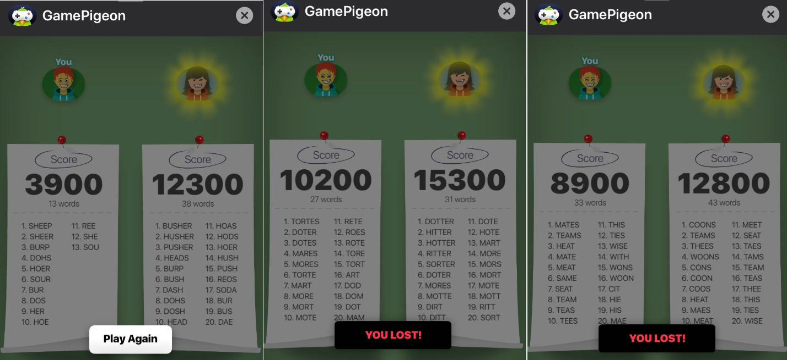
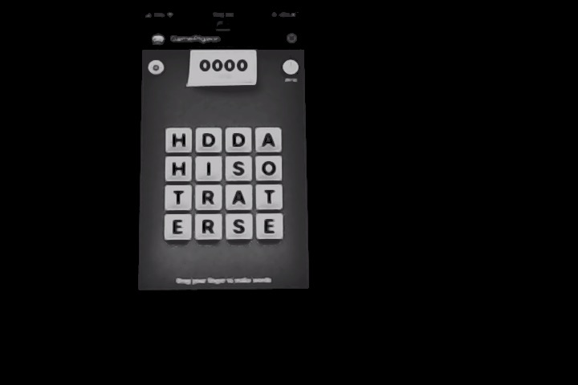
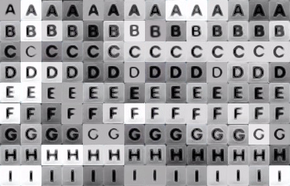
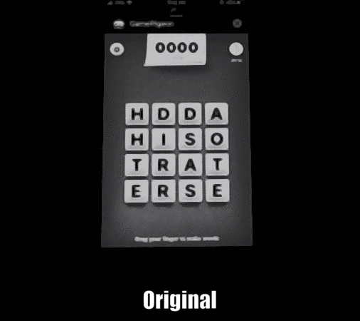
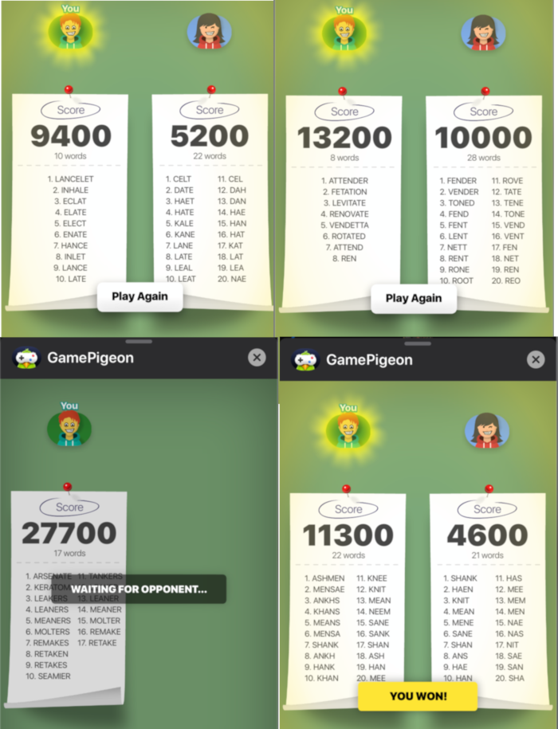

My wife and I play the [iMessage game Word Hunt](https://apps.apple.com/us/app/gamepigeon/id1124197642) throughout the day, and she wins about 80% of the time. She's kicking my ass.

Word Hunt is a word search game that uses a 4x4 grid of scrabble-like tiles. The objective is to get as many points as you can in 80 seconds by finding words in the tiles. One key aspect is that longer words are scored disproportionately higher than shorter words. This is important to note for later. 

Here are a few examples of the many, many losses against my wife.




I brainstormed a few cheating methods to explore. The main challenge was to come up with a way of extracting the position and letter of each board tile. Once extracted, building a word search solver program was much more straightforward.

### Choosing a method

**Manually typing the board into a cheating program**

The first idea I had was to build a web or console interface that I would manually type the generated board into when the game starts. I had seen websites like this before for cheating at Scrabble. This would take a few seconds at the beginning of each game, but since there are only 16 tiles, it's a pretty quick and simple approach.

**Sniffing the packets to generate the board**

Next I thought that since the board is displayed on the phone, and iMessage can work over Wifi, there must be some packets received by the phone that describe the game board. It would probably be simple enough to open Wireshark, reverse engineer the messages, and automatically dump the board into a solver program immediately when the game starts.


**Using computer vision to extract the board from the game**

Finally, I thought about using computer vision to extract the game board. We also already do some computer vision projects at Hookshot. Although this would be the most time consuming approach, I figured it would also be the most fun. The plan would be to write a program that uses OpenCV to read frames from my webcam, detect the game board, extract the tile positions and letters, and run a solver against the generated board. A stretch goal was to overlay the position of the next-longest solved word on the OpenCV frame. This way I could swipe the board and win the game without looking back and forth between the solver and the phone.


### Building the system

I decided on the computer vision approach, because it seemed like it would be the most fun and present the best. I also wanted to explore the machine learning capabilities of OpenCV.

First I looked for other examples online detecting letters with OpenCV. I found a fantastic guide for [detecting handwritten characters](https://medium.com/@muehler.v/machine-learning-with-opencv-and-javascript-part-1-recognizing-handwritten-letters-using-hog-and-88719b70efaa) with OpenCV and Javascript. It relies on a really handy library called [opencv4nodejs](https://github.com/justadudewhohacks/opencv4nodejs) that has nodejs bindings for OpenCV and a ton of examples. Major credit to Vincent Mühler for the library and guide.

The tutorial describes using a Support Vector Machine (SVM) as a simpler alternative to the neural network. I'm a machine learning beginner, so I just followed the examples provided and tweaked the configuration to see if it could be made to work for my problem set.

### Gathering training data

I started by setting up a Logitech C920 to point straight down at my table, and to played with the brightness settings on my phone and also the [Logitech Camera Settings app](https://apps.apple.com/ro/app/logitech-camera-settings/id638332853?mt=12) to make the tiles stand out more. Then I took some photos of my phone during games of Word Hunt.



I started by manually extracting letters from various angles and lighting conditions. The goal here was to collect a small subset of the alphabet to try out the training process before spending all of the time on the complete set of letters.



This ended up being extremely time consuming. It took hours to even get 14 examples of the letters A - I. It turns out to be difficult to quickly select 30x30 pixel boxes across many images in GIMP.

### Training 

My images were 30x30, so I updated the cv.HOGDescriptor call from the tutorial to look like this:

```
cv.HOGDescriptor({
  winSize: new cv.Size(30, 30),
  blockSize: new cv.Size(10, 10),
  blockStride: new cv.Size(10, 10),
  cellSize: new cv.Size(5, 5),
  L2HysThreshold: 0.2,
  nbins: 24,
  gammaCorrection: true,
  signedGradient: true
});
```

Initially I had a smaller value `cellSize`, as I believed smaller cell size = more computation = more accuracy! But that worked terrible. My theory is that a small cell size is too "zoomed in" for the SVM to properly understand the features of the letters. In the end, 5x5 worked well for me.

Eventually, I had the SVM built and it seemed to be mostly detecting the right letters during testing. I don't have a record of the exact success rate, but from memory it seemed about 70% accurate on my small sample of test cases. At the time, I was really relying on the idea that the failures were due to small sample size of data rather than some fundamental flaw of the system.


### Testing

Since I would eventually need a way to automatically extract the tiles and their positions from the image, I realized that I could build that program sooner than later to automatically derive my training and testing sets much faster than manually cropping the tiles from the images in GIMP.

I built a [tile extraction program](https://github.com/vedran/word-hunter/blob/master/capture.js) that used [OpenCV binary thresholding](https://docs.opencv.org/master/d7/d4d/tutorial_py_thresholding.html) and [Canny edge detecting](https://docs.opencv.org/trunk/da/d22/tutorial_py_canny.html) to detect the tiles and extract the contents into 30x30 images automatically. 

Then I built a [labelling program](https://github.com/vedran/word-hunter/blob/master/labeler.js) that showed each extracted tile and prompted for a single key press to label that image.

Using this process, I was able to extract and label 3500 tiles in about an hour. I only used the first 100 images for each letter to train the SVM, as it requires the same number of samples for each letter. The letters J and Z are very rare in Word Hunt games, and my training data didn't have a single example game with either of those letters. 

```
Letter    |    Samples
----------------------
a         |        185
b         |        144
c         |        147
d         |        186
e         |        157
f         |        115
g         |        145
h         |        159
i         |        158
j         |          0
k         |        153
l         |        120
m         |        110
n         |        159
o         |        150
p         |        136
q         |        138
r         |        174
s         |        266
t         |        256
u         |        133
v         |        139
w         |        194
x         |        102
y         |        118
z         |          0

```


After some trial and error the parameters for the HOGDescriptor, the binary thresholding, and the Canary edge detection, I ended up with a 100% success rate for tile letter detection while testing about a dozen new Word Hunt games.


### Solving

Now that I had a way to extract tiles in bulk and identify the letters, the next step was to build a game board solver that combined all of the pieces.

First I downloaded a [scrabble dictionary JSON dump](https://github.com/benjamincrom/scrabble/blob/master/scrabble/dictionary.json).

Then I added a sorting component to the tile extraction to properly re-create the game board based on the tile positions:

```
const sortedTiles = []

// Sort by y
tiles.sort((a, b) => a.y - b.y)

for (let i = 0; i < 4; i++) {
  // Grab the next 4 tiles
  const nextRow = tiles.splice(0, 4);

  nextRow.sort((a, b) => a.x - b.x)
  sortedTiles.push(...nextRow)
}

    const board = [
  ["#", "#", "#", "#"],
  ["#", "#", "#", "#"],
  ["#", "#", "#", "#"],
  ["#", "#", "#", "#"],
]

let col = 0;
let row = 0;
sortedTiles.forEach(tile => {
  board[row][col] = tile.label;
  col += 1;

  if(col > 3) {
    col = 0;
    row += 1;
  }
})

```

I used a trie and DFS approach based on a solution to the [Wordsearch II Leetcode problem](https://leetcode.com/problems/word-search-ii/) to solve the game board. Once the board is represented by a 2D array, the solver builds a trie from the dictionary.json of all the words that are less than 9 letters (the max allowed for a word in the game). Then the solver applies a [DFS](https://en.wikipedia.org/wiki/Depth-first_search) for the board against the trie.

Finally, the solver prints both the parsed game board (for debugging) and the first 30 longest words that were found in the game board.

The entire process looks like this:




```
	➜  word-hunter-node git:(master) ✗ node board.js
	[ [ 'h', 'd', 'd', 'a' ],
	  [ 'h', 'i', 's', 'o' ],
	  [ 't', 'r', 'a', 't' ],
	  [ 'e', 'r', 's', 'e' ] ]
	[ 'artistes',
	  'starters',
	  'disrates',
	  'iterates',
	  'tearers',
	  'starers',
	  'thirsts',
	  'disrate',
	  'artiste',
	  'soarers',
	  'artists',
	  'iterate',
	  'starter',
	  'searer',
	  'hirers',
	  'artist',
	  'aristo',
	  'airers',
	  'tearer',
	  'triste',
	  'thirst',
	  'terais',
	  'terrae',
	  'terras',
	  'odists',
	  'stairs',
	  'soarer',
	  'starer',
	  'tarter',
	  'sirras' ]
```
 

## Winning

With the power of decades of computer vision research from OpenCV's, I was finally able to beat my wife at Word Hunt. At the end of the day, the person with the most points wins.




