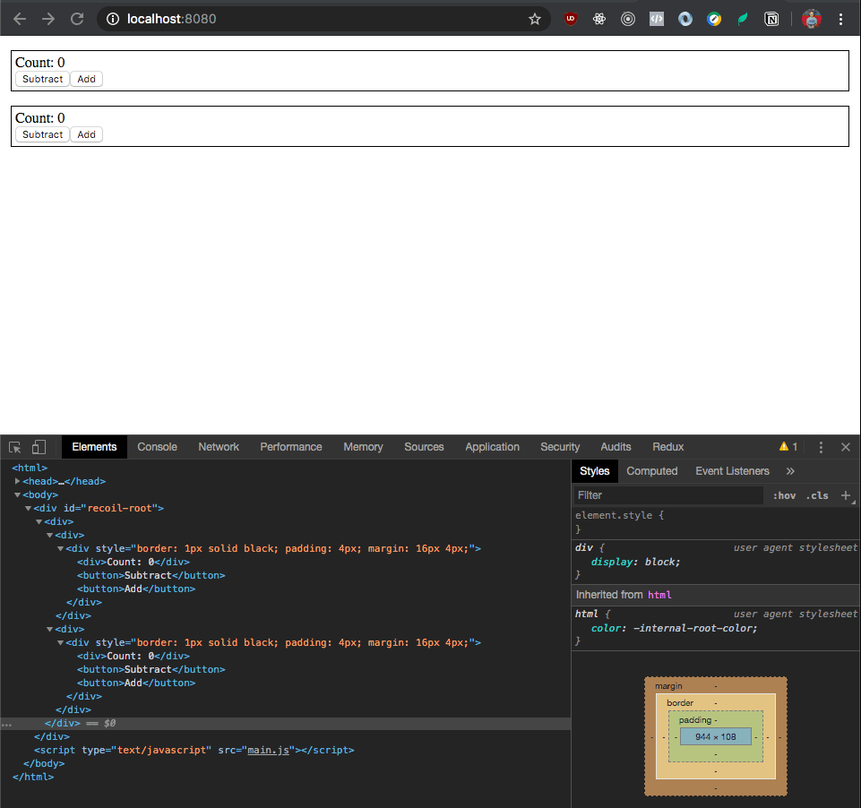

In the [last post](/blog/building-react-hooks/) I added Hooks and onClick handler support to my React clone called [Recoil](https://github.com/vedran/recoil).

One major remaining limitation in recoil is that it still re-renders the entire app when _any_ component is updated with the setState Hook.

Not only is this inefficient, but it also makes it impossible to rely on the implicit state of HTML elements, like the cursor position and focus state of an `<input>` tag.

Last time, our event loop ended up like this:

```javascript
function eventLoop() {
  if (NEEDS_TO_RENDER) {
    console.log("RENDERED")

    //
    // NOTICE: We convert the app into DOM elements on each loop
    //
    const rootElement = document.getElementById("recoil-root")
    rootElement.innerHTML = ""
    rootElement.appendChild(buildDOM(app))
    NEEDS_TO_RENDER = false
  }
}

setInterval(eventLoop, 100)
```

But we want our event loop to operate like this instead:

```javascript
// Set the root element contents only once
const rootElement = document.getElementById("recoil-root")
rootElement.innerHTML = ""
rootElement.appendChild(updateOrCreateDOM(app))

function eventLoop() {
  // Re-generate the DOM (if necessary) for any wrappers
  // that have been marked as changed
  while (WRAPPERS_TO_RENDER.length > 0) {
    // updateOrCreateDOM() will traverse the wrappers and
    // update the DOM elements that correspond to wrappers
    // that have changed
    updateOrCreateDOM(WRAPPERS_TO_RENDER[0])
    WRAPPERS_TO_RENDER.shift()
  }
}
```

To make this happen, we have to do the following things at the lower layers of code:

1. Expand our `buildDOM()` function from to handle both initial DOM creation for new wrappers and DOM updates on existing wrappers
1. Update useState to not set the global `NEEDS_TO_RENDER=true`, but instead keep track of which particular wrapper needs to be re-rendered

Additionally, I found a few bugs/improvements to make in my implementation from [last time](/blog/building-react-hooks/):

1. Stop generating an extra `<div>` around each `<div>` component
1. Instead of `DivComponent` and `ButtonComponent`, make a more generic function called `createHtmlComponent` that takes a `tag` prop
1. Add support for passing arbitrary attributes to elements

Note that even after this is implemented, we'll still need to implement the React concepts of mounts/unmounts re-renders. This new planned implementation will still cause any updated components to unmount and re-mount.

### Updating buildDOM()

Let's start with converting `buildDOM()` to `updateOrCreateDOM()`, a function that can handle the DOM creation and update cases.

There are two main steps needed to add DOM updating support:

1. Each wrapper needs a reference to the DOM element that it represents
1. The wrapper element need to replace its inner content with the re-rendered DOM elements if the wrapper state has changed through useState

Converting the original `buildDOM()` to `updateOrCreateDOM()` with the relevant cahnges looks like:

```javascript
function updateOrCreateDOM(wrapper) {
  //
  // CHANGE
  // Check for an existing element for this component wrapper
  //
  var element =
    wrapper.element || document.createElement(wrapper.tagName || "div")

  var stringOrWrapper = wrapper.render()
  const childrenType = typeof stringOrWrapper

  //
  // CHANGE
  // Remove the arbitrary restriction for onclick only being on html components
  //
  if (wrapper.props.onClick) {
    element.onclick = wrapper.props.onClick
  }

  if (childrenType === "string") {
    //
    // CHANGE
    // Always replace the inner content to handle both the create and update cases
    //
    element.innerHTML = ""
    element.appendChild(document.createTextNode(stringOrWrapper))
  } else if (childrenType === "object") {
    let childWrappers = Array.isArray(stringOrWrapper)
      ? stringOrWrapper
      : [stringOrWrapper]

    //
    // CHANGE
    // Always replace the inner content to handle both the create and update cases
    //
    element.innerHTML = ""
    childWrappers.map(child => element.appendChild(updateOrCreateDOM(child)))
  } else {
    throw Error(`Unknown component type: ${typeof stringOrWrapper}`)
  }

  //
  // CHANGE
  // Save a reference to this element on the wrapper, so that when the component updates,
  // we know that this wrapper has an existing HTML element to replace
  //
  wrapper.element = element
  return element
}
```

### Updating useState

To update useState, we just need to remove the code that sets the global `NEEDS_TO_RENDER` flag, and instead just append the updated wrappers to an array for the event loop to handle.

```javascript
function useState(defaultVal) {
  const { curStateIndex, states, wrapper } = useState.stateInfo
  useState.stateInfo.curStateIndex += 1

  if (curStateIndex > states.length - 1) {
    useState.stateInfo.states.push(defaultVal)
  }

  return [
    states[curStateIndex],
    newVal => {
      states[curStateIndex] = newVal

      //
      // REMOVED
      // NEEDS_TO_RENDER = true

      //
      // ADDED
      // Append changed component wrappers to list if they don't already exist
      if (!WRAPPERS_TO_RENDER.find(w => w === wrapper)) {
        WRAPPERS_TO_RENDER.push(wrapper)
      }
    },
  ]
}
```

### Improve HTML element creation

My last iteration of recoil had a bug where we kept adding an extra div around every HTML component. Additionally, the API I decided on for creating HTML elements in general wasn't very good.

Previously, we used to build elements like divs in this way:

```javascript
function DivComponent({ children = [], ...otherProps }) {
  return createElement(() => children, otherProps, "div")
}

createElement(DivComponent)
```

Notice how we're calling createElement with the `DivComponent` function as an argument, and then within `DivComponent` we're calling `createElement` again. This is the cause of the excess `<div>` generation.

We can solve both problems by creating a special function for creating elements like so:

```javascript
function createHtmlComponent({ children = [], tag, ...otherProps }) {
  return createElement(() => children, otherProps, tag)
}

createHtmlComponent({ tag: "div" })
```

### Add attribute support

To make recoil more useful we want to be able to pass arbitrary HTML attributes (e.g. style) to our components. This one is a quick addition in `updateOrCreateDOM()`:

```javascript
function updateOrCreateDOM(wrapper) {
  [...]

  var element =
    wrapper.element || document.createElement(wrapper.tagName || "div")

  //
  // Extract the onClick attribute, and pass everything else along
  //
  const { onClick, ...attributeProps } = wrapper.props
  if (onClick) {
    element.onclick = onClick
  }

  Object.entries(attributeProps).map(([key, value]) => {
    element.setAttribute(key, value)
  })

  [...]
}
```

### Putting it all together

I've prepared a small demo that has a counter component. The component shows a count, and has two buttons for increasing and decreasing the current count. Each counter component uses Hooks to keep track of its own count.

```javascript
function CounterComponent() {
  const [count, setCount] = useState(0)

  return [
    createHtmlComponent({
      tag: "div",
      style: "border: 1px solid black; padding: 4px; margin: 16px 4px;",
      children: [
        createHtmlComponent({
          tag: "div",
          children: `Count: ${count}`,
        }),
        createHtmlComponent({
          tag: "button",
          onClick: () => setCount(count - 1),
          children: "Subtract",
        }),
        createHtmlComponent({
          tag: "button",
          onClick: () => setCount(count + 1),
          children: "Add",
        }),
      ],
    }),
  ]
}

let app = createHtmlComponent({
  children: [createElement(CounterComponent), createElement(CounterComponent)],
  tag: "div",
})

const rootElement = document.getElementById("recoil-root")
rootElement.innerHTML = ""
rootElement.appendChild(updateOrCreateDOM(app))

function eventLoop() {
  while (WRAPPERS_TO_RENDER.length > 0) {
    updateOrCreateDOM(WRAPPERS_TO_RENDER[0])
    WRAPPERS_TO_RENDER.shift()
  }
}

setInterval(eventLoop, 100)
```

And here's how it looks in action:



You can find all of the code for this iteration on [Github](https://github.com/vedran/recoil/blob/master/src/iterations/4_per_component_renders.js).

One of the major flaws in this iteration is that recoil still doesn't support the distinction between rendering and mounting. Every render is a remount/unmount of the underline DOM element, though the Wrapper still remembers the state.

Next time we'll implement some basic [reconciliation](https://reactjs.org/docs/reconciliation.html), so that we don't automatically unmount and remount the changed DOM elements on every state change. That will allow us to start supporting things like `<input>` tags, and forms in general.

<blockquote class="twitter-tweet">
  <p lang="en" dir="ltr">
    Continuing my deep dive into{" "}
    <a href="https://twitter.com/hashtag/reactjs?src=hash&amp;ref_src=twsrc%5Etfw">
      #reactjs
    </a>{" "}
    by building a React clone from scratch. This time I write about adding
    support for rendering only components that have changed.
    <a href="https://t.co/FU87fOdHVc">https://t.co/FU87fOdHVc</a>
  </p>
  &mdash; Vedran Budimcic (@vbudimcic) <a href="https://twitter.com/vbudimcic/status/1228446422434902017?ref_src=twsrc%5Etfw">February 14, 2020</a>
</blockquote>
<script
  async
  src="https://platform.twitter.com/widgets.js"
  charset="utf-8"
></script>
