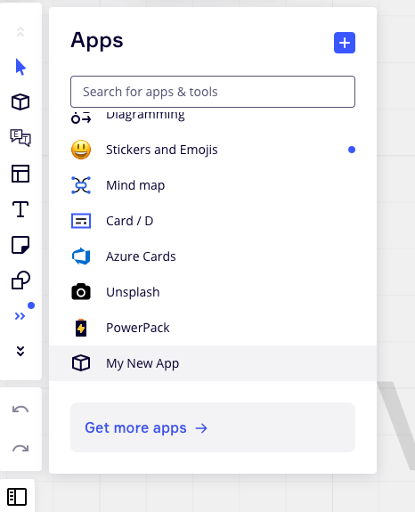
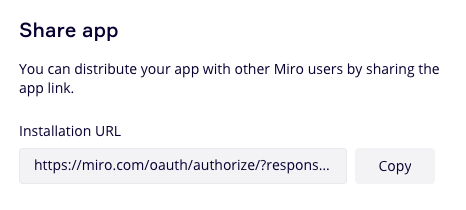
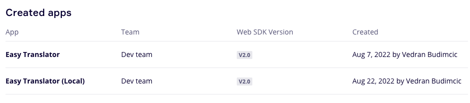
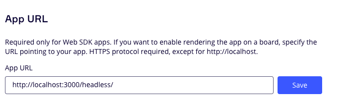

Over the past 4 years, I've built over a dozen apps/integrations for platforms like Greenhouse, Figma, FigJam, Coda, Zoom, Slack, and Miro. Some of these were complete flops that took months to build and didn't resonate with users, while others had steady user growth and led to successful acquisitions. Most recently, I built the [Easy Translator](https://miro.com/marketplace/easy-translator/) plugin for Miro. Check it out if you find yourself frequently translating Miro board content.

Miro is actually running a [Community App Contest](https://developers.miro.com/page/announcing-our-community-apps-contest) right now to encourage developers to join their [new developer platform](https://miro.com/blog/developer-platform-beta/) and launch apps to the 35 million users who use Miro every month. The contest is open until October 14th, so I wanted to take this time to share the things I've learned that I hope will help contest participants build successful apps and launch them quickly.

For this post, I will focus on apps that use the [Miro Web SDK](https://developers.miro.com/docs/miro-web-sdk-introduction), but Miro also has a [REST API](https://developers.miro.com/reference/api-reference) and [Live Embeds](https://developers.miro.com/docs/miro-live-embed-introduction) that are definitely worth checking out.

This post also assumes that you've read the [Miro Web SDK hello world example](https://developers.miro.com/docs/build-your-first-hello-world-app) and that you understand [how the Miro Web SDK works](https://developers.miro.com/docs/app-panels-and-modals).

### Start with a simple template

I build my Miro apps with React and Typescript, and I've created a basic template that I re-use for each new app. 

I start with the [Create React App template](https://reactjs.org/docs/create-a-new-react-app.html#create-react-app):
```
npx create-react-app my-app-name --template typescript
```


Then I modify `public/index.html` to include the Miro Web SDK script:

```html
<!DOCTYPE html>
<html lang="en">
  <head>
    [...]
    <script src="https://miro.com/app/static/sdk/v2/miro.js"></script> //highlight-line

    <title>Your app title</title>
  </head>
  <body>
    [...]
  </body>
</html>
```

Next I add a routing system using [React Router](https://reactrouter.com/en/main) so that I can cleanly separate the code that runs in the [headless iframe](https://developers.miro.com/docs/app-panels-and-modals) to initialize the app from the code that powers the user-visible panel.

```jsx
// src/index.js
import { BrowserRouter, Routes, Route } from "react-router-dom"
import * as ReactDOM from "react-dom"
import Panel from "./Panel"
import Headless from "./Headless"

const App = () => (
  <div>
    <Routes>
      <Route path="/headless/*" element={<Headless />} />
      <Route path="/panel/*" element={<Panel />} />
    </Routes>
  </div>
)

ReactDOM.render(
  <BrowserRouter>
    <App />
  </BrowserRouter>,
  document.getElementById("root")
)
```

```jsx
// src/Headless.tsx
import { useEffect } from "react"

const Headless = () => {
  useEffect(() => {
    window.miro.board.ui.on("icon:click", async () => {
      await window.miro.board.ui.openPanel({
        url: `/panel`,
        height: 600,
      })
    })
  }, [])

  return null
}

export default Headless
```

```jsx src/Panel.tsx
const Panel = () => <div>Hello!</div>

export default Panel
```

If you use this approach, you should have a simple Miro Web SDK app with an icon in the sidebar that will open a panel that says "Hello!" when clicked. You may need to look under "More tools" to find your app.




### Share your app with potential users as soon as possible

Many platforms require you to publish apps, share code directly, or restrict unpublished app sharing to your team only.

Miro allows you to share your unpublished app with _any_ Miro user. Take advantage of this amazing feature by sharing your app early and often. Find your [App Settings](https://miro.com/app/settings/user-profile/apps
) and scroll down to the Share app section to copy a shareable link.



Share this link to people you consider early adopters who will give direct and honest feedback to improve your app.

Note: Before sharing the link, make sure your app is deployed to a domain that other users can access. If your app is only running on localhost, you can use a tool like [ngrok](https://ngrok.com/) to generate a publicly accessible URL that serves your locally running app. Be sure to update your App URL to point to this domain as well.

### Don't build a backend unless you need it

A Miro Web SDK app is just an iframed webpage that uses an SDK to communicate with the current Miro board. This means you can serve a Miro app from any of the popular platforms for hosting static sites. I use [Netlify](https://www.netlify.com) to deploy the frontend of my apps because it is free and provides a publicly accessible URL I can use to host my Miro app directly. Netlify hosting also satisfies the TLS and HSTS requirements from [Miro's App security guidelines](https://developers.miro.com/docs/security-guidelines) out of the box.

Challenge yourself to consider whether you can launch the first version of your app without a backend.

Typically you'll need a backend to store data permanently or to restrict access to sensitive content like user data, API credentials, databases, etc. If your app doesn't have these requirements, but still needs to store some data, consider using Miro Web SDK functions like [setAppData](https://developers.miro.com/docs/board_board#setappdata) and [getAppData](https://developers.miro.com/docs/board_board#getappdata) to save data into the board directly. You can also use [App Cards](https://developers.miro.com/docs/appcard_appcard-1) to store information, or even your browser [localStorage](https://developer.mozilla.org/en-US/docs/Web/API/Window/localStorage), depending on your use case.

If you _do_ need a backend, don't start with a complex architecture that can scale to millions of users. Embrace some tech debt (for now) and use technologies you're comfortable with. Personally I use [Digital Ocean](https://m.do.co/c/6fe0a1d89570)'s App Platform because I find it simpler to manage than AWS, but I've also heard good things about [Netlify](https://www.netlify.com/products/functions/).


### Use the authentication feature included with the Miro Web SDK

If your app needs authentication, typically that means you need to support:
- Signing in
- Signing out
- Signing up
- The app experience for both signed in and non-signed-in users
- Authenticating with username and password, a magic link, or something like "Sign in with Google"
- Forgot my password flows
- Database to store the user's details and their session

I recommend you _skip all of that_ by using the authentication built into the Miro SDK.

The JWT-based authentication from the [board.getIdToken()](https://developers.miro.com/docs/board_board#getidtoken) function will generate a secure token that represents the current user's session. You can send this token to your backend with every API request and use the [client secret](https://developers.miro.com/docs/build-your-first-hello-world-app#step-4-configure-your-app-in-miro) to verify the request.

Here's a Typescript example for making authenticated requests using `miro.board.getIdToken()`:

```jsx
// A helper function to make authenticated requests to your backend endpoints
export const fetchAPI = async (endpoint: string, params: any) => {
  const miroToken:string = await window.miro.board.getIdToken()
  const resp = await fetch(`${API_BASE_URL}${endpoint}`, {
    ...params,
    headers: {
        authorization: `Bearer ${miroToken}`,
    }
  }

  if (!resp.ok) {
    throw new APIError(resp)
  }

  return resp
}

```

Here's a sample backend python function that uses the popular [PyJWT](https://pypi.org/project/PyJWT/) library to validate the authenticated request and returns the Miro user ID.


```py
from django.conf import settings
import jwt

def get_authenticated_miro_id(request):
    AUTH_ERROR = 'Authentication failed'

    auth_header = request.META.get('HTTP_AUTHORIZATION')
    if not auth_header:
        raise Exception(AUTH_ERROR)

    # Extract the token from the authorization header, which is in the format "Bearer <token>".
    auth_split = auth_header.split(' ')
    if len(auth_split) != 2:
        raise Exception(AUTH_ERROR)

    # Use the JWT library to simultaneously decode and verify the token was signed with your app secret
    auth_data = jwt.decode(auth_split[1], key=settings.MIRO_CLIENT_SECRET, algorithms=['HS256'])
    if auth_data['iss'] != 'miro': 
        raise Exception(AUTH_ERROR)

    miro_user_id = auth_data['user']:
    if not miro_user_id:
        raise Exception(AUTH_ERROR)
    
    return miro_user_id
```


### Maintain a functioning local development environment

As you begin iterating on your app with real user feedback, you'll find it helpful to maintain a local development environment that allows you to test bug fixes and build new features without affecting the production version of the app.

To do this, I recommend you create two versions of your app in Miro. One always pointing at your local environment, and one pointing to the production URL.





### Use Miro's official CSS library

The [Mirotone](https://www.mirotone.xyz/css) CSS library has been invaluable for quickly building components that meet [Miro's design guidelines](https://developers.miro.com/docs/design-guidelines). Even though there is no native React support, you can use it by using the provided class names to create tabs, buttons, forms, icons and more.

### Avoid a complicated billing system if you can

Building a billing system is not easy. Users need to be able to make purchases, change and cancel plans, use promo codes, and enter payment method details,

I recommend that you break down each billing requirement into individual pieces, and build them one-by-one as needed. For example, if your app includes a 7 day trial, then don't actually need a payment system for at least 7 days. Instead, take this time to discover active users to learn why they decided to install your app and whether it meets their expectations.

Even when you implement payment support, consider the number of active users you expect to have and whether you actually need a fully automated billing system. Consider whether you can support cancellation and plan change requests through a simple form that just emails you the request for you to manually update in your payment gateway (Stripe, Braintree, etc).

In terms of the technology to use to support purchases, I'm a fan of the Stripe ecosystem. In addition to their rich API, they also offer no-code/low-code options for both one-time purchases and subscriptions.

* [Stripe Payment Links](https://stripe.com/en-ca/payments/payment-links) are no-code direct checkout links to specific products. Hosted on Stripe
* [Stripe Checkout](https://stripe.com/docs/payments/checkout) low-code checkout flow that integrates into your existing site
* [Stripe Customer Portal](https://stripe.com/docs/billing/subscriptions/integrating-customer-portal) is a full subscription management service

If you're using Stripe Payment Links or Stripe Checkout, make sure to set a `client_reference_id` URL parameter with the value of a unique identifier for the current user so that you can connect the successful purchase to the correct user.

Here's a Django example of how you can implement a webhook endpoint that will receive the `checkout.session.completed` event from Stripe when a user has completed a purchase using Stripe Payment Links or Stripe Checkout:


```python
class StripeWebhookView(GenericAPIView):
    permission_classes = [AllowAny]

    def post(self, request):
        """
        Stripe webhook requests
        """

        # Check stripe signature
        sig_header = request.META['HTTP_STRIPE_SIGNATURE']
        payload = request.body
        event = None

        try:
            event = stripe.Webhook.construct_event(payload, sig_header, settings.STRIPE_WEBHOOK_SECRET)
        except ValueError as e:
            # Invalid payload
            print("Invalid payload")
            return HttpResponse(status=400)
        except stripe.error.SignatureVerificationError as e:
            # Invalid signature
            print("Invalid signature")
            return HttpResponse(status=400)

        event_type = event.type
        if event_type == 'checkout.session.completed':
            checkout_session = event.data.object

            user_uuid = checkout_session.client_reference_id
            user = User.objects.get(uuid=user_uuid)
            user.purchased = True
            user.save()

        return Response()


```


### Conclusion

I hope you found these tips useful to speed up your Miro app development process. I will be writing more content on this topic, so if you're interested, enter your email below to be notified when new posts are published.

In the meantime, check out my [Easy Translator app for Miro](https://miro.com/marketplace/easy-translator/), and stay tuned for my upcoming Search and Replace app.

<Form />

