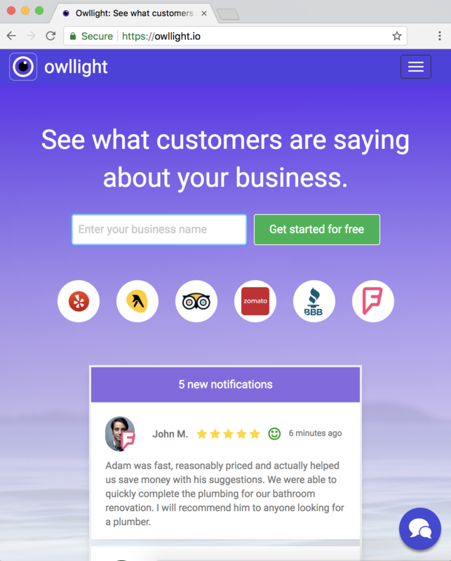

## Pricefox

Pricefox was an investor-backed mobile app that allowed users to find products and compare prices at nearby retail locations.

Users could search for an individual product by scanning the barcode, or create a whole shopping list to compare the total price of an entire shopping trip at multiple retailers at the same time.

The product and price databases were built by collecting, deduplicating, and combining data from several sources including crowd sourcing, manual scanning, and crawling of online retail flyers.

I developed the Android app as well as the backend system which included the crowd sourcing, web crawling, and powered all of the features of the app.

Built with Java, Golang, Python, Postgresql, Elasticsearch. Hosted on Digital Ocean and AWS.

## Cheeky

Cheeky was an investor-backed mobile app that allowed any emerging influencer to earn rewards for taking fashion selfies. It replicated most of Instagram's functionality, but also had fashion related challenges and themes.

Users could post a photo, tag the fashion and makeup products they were wearing, and then earn rewards when other users purchased products through their referrals.

The product database had tens of millions of entries and was built up through affiliate partnerships with hundreds of retailers including Forever 21, Banana Republic, Walmart, and Target.

I developed both Android and iOS apps, the website, and the backend system that powered the entire project.

Built with React Native, Golang, Python, Postgresql, Elasticsearch. Hosted on Digital Ocean and AWS.

## Willowy

Willowy is a website that helps hiring managers organize and schedule take-home interviews.

It allows users to build custom questionnaires and take-home interview assessments and distribute them to job candidates without worrying about scheduling and timing. The candidate assessments can have time limits and deadlines. I designed and developed the website and backend system that powers it.

Willowy was acquired in 2019.

Built with Ruby on Rails. Hosted on Digital Ocean and AWS.

## Owllight

Owllight is a website that allows business owners to track reviews across all of the top websites in a single place. This includes Yelp, Yellow Pages, Trip Advisor, Zomato, Better Business Bureau, and Foursquare.

Business owners can track specific pages, get notified when a review is made, and be directed to a review so that they can respond.

I designed and developed the website and backend system that powers it, including the crawling system that tracks business reviews.

Built with Ruby on Rails. Hosted on Digital Ocean and AWS.
