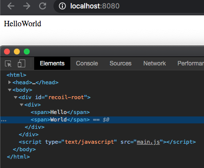

Although I'm a daily React user, I've never done a deep dive into how React works under the hood.
I rely on the 20% knowledge I have to leverage 80% of the benefits for building web apps.

After taking [Kent C. Dodds](https://kentcdodds.com/)' course on [Frontend Masters](https://frontendmasters.com/courses/advanced-react-patterns/),
I've had the urge do a deep dive into the guts of React to really internalize how it works. I'm also a lifelong generalist and have never taken the time to deeply learn a topic just for the sake of learning.

To this end, I'm going to build a simple version of React from scratch. Let's pretend that [Dan](https://overreacted.io/) _did_ delete the codebase!

I'll rely on my own shallow understanding of the React API, as well as some API documentation if I get stuck.
After each notable feature, I'll compare and contrast my work with the true React implementation.

Many others have done similar projects, but for learning purposes I'm going to avoid reading their posts and see how far I can get.

By the powers of thesaurus.com, this project will be called `recoil`.

## Goals

The goal for `recoil` is to support at least:

- Generating HTML from functions (aka Components)
- HTML elements (e.g. div, span, etc)
- Passing props to custom components and HTML elements
- Internal component state w/hooks
- Re-rendering on change state
- One-way data binding
- Reconciliation
- Context API
- JSX through its own webpack plugin

I'll write about each feature as I build them. That means that I'll make some decisions early on that I won't realize are terrible ideas until they later feature from being built.

With that said, let's get started with the basics.

## Rendering components

My understanding of the component rendering process is that React turns functions and objects (aka Components) into HTML elements, and inserts them using the browser's API.

Let's start with a function that can create regular html elements (div, span, etc). Our function should be able to take in components and return HTML that looks something like this:

```html
<div>
  <span>
    Hello
  </span>
  <span>
    World
  </span>
</div>
```

Let's call that function `createElement`. It will need an API that looks something like this:

```javascript
function createElement(elementType, props, render) {
  ...
}
```

We can start filling in this method. Regardless of the props provided or how render works, we will need to create the opening and closing tags for the element.

```javascript
function createElement(elementType, props, render) {
  let html = ""

  // Create the opening tag
  html += `<${elementType}>`

  // TODO: Handle rendering by iterating over the results of each child's render call
  html += render()

  // Create the closing tag
  // NOTE: We're assuming all elements have both opening and closing tags.
  // This isn't always the case
  html += `</${elementType}>`
}
```

Now we just need to figure out how `render()` will work. I believe that the JSX `<div>` and `<span>` tags are just syntactic sugar for calling `createElement()`. So that means any children of a component would have already called `createElement` and turned into HTML strings .

```javascript
function createElement(elementType, props, render) {
  let html = ""

  // Create the opening tag
  html += `<${elementType}>`

  // Call render, which we expect to return an array of 0 or more children.
  // By now, each child is just a string of HTML, since that's what createElement returns.
  // All we need to do is join the resulting strings together to build up the entire app.
  html += render(props).join("")

  // Create the closing tag
  // NOTE: We're assuming all elements have both opening and closing tags.
  // This isn't always the case
  html += `</${elementType}>`

  return html
}
```

Regular HTML elements have very simple `render` methods. They just create some opening and closing tags, and render their children between those tags. Since we are already taking care of the tags in `createElement`, we just need to make sure that `render` returns an array that we call `join()` on.

```javascript
function renderHtmlComponent({ children }) {
  return Array.isArray(children) ? children : [children]
}
```

Then we can re-create the sample HTML above as a set of `createElement` calls.

```javascript
var demoApp = createElement(
  "div",
  {
    children: [
      createElement("span", { children: "Hello" }, renderHtmlComponent),
      createElement("span", { children: "World" }, renderHtmlComponent),
    ],
  },
  renderHtmlComponent
)
```

Finally, we need to create a `<div>` in `index.html` for recoil to insert the result of the rendering.

```javascript
document.getElementById("recoil-root").innerHTML = demoApp
```

After putting it all together, we've successfully created these simple elements and put them inside of `recoil-root`:



Although we're still light years away from React, we've at least explored the basics of turning functions into DOM elements.

Next up will be adding support for both HTML and non HTML components, as well as adding props.
